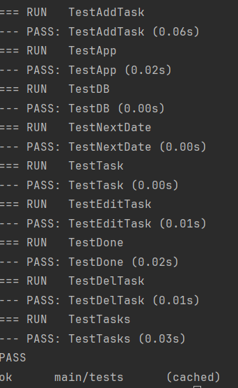

Таск-Менеджер, который позволяет добавлять, редактировать, удалять задачи, получать список ближайших задач
=================================
   При первом запуске API, если база данных не существует, то будет создана в корне проекта.

   Также, если в нет файла ".env", то он будет создан в корне проекта.

   После запуска в консоли будет выведен адрес на котором запущен API.

1. Порт

   Стандартный порт для API, по умолчанию - 7540
   Чтобы изменить порт на котором будет работать API, необходимо присвоить значение переменной окружения "TODO_PORT" в файле ".env" который находится в корне проекта.
   (при работе с Docker необходимо указать порт в ENV в Dockerfile)

2. Путь к базе данных

   Стандартный путь к базе данных, по умолчанию - "./scheduler.db"
   Чтобы изменить путь к базе данных на котором будет работать API, необходимо присвоить значение переменной окружения "TODO_DBFILE" в файле ".env" который находится в корне проекта.
   (при работе с Docker необходимо указать путь к базе данных в ENV в Dockerfile)

3. Пароль

   Если пароль не указан, то API будет работать без аутентификации
   Чтобы добавить/изменить пароль, необходимо присвоить значение переменной окружения "TODO_PASSWORD" в файле ".env" который должен находится в корне проекта.
   (при работе с Docker необходимо указать пароль в ENV в Dockerfile)

Тесты
=================================
Чтобы запустить тесты для проверки полного функционала локально:
1. Определить переменные окружения TODO_PORT, TODO_DBFILE и TODO_PASSWORD в файле .env в корне проекта

2. Придать переменным в файле settings.go в папке tests значения:

   Port - Значение из переменной окружения TODO_PORT или порт 7540 при запуске на стандартном порте

   DBFile - Значение из переменной окружения TODO_DBFILE или путь к базе данных в корне проекта

   FullNextDate - Значение true

   Search - Значение true 

   Token - Результат выполнения функции hashPassword из файла api/server.go 

   Для этого нужно ввести пароль из TODO_PASSWORD в окне аутентификации сервиса "http://localhost:7540/login.html"(Порт может отличаться) предварительно запустив сам сервис командой "go run main.go", токен будет выведен в консоль

3. Запустить тесты: "go test -v .\tests\"

Чек-лист:
=================================
Шаг 1. Запускаем веб-сервер: выполнено основное и дополонительное⭐ задания, проходят тесты
---------------------------------
Шаг 2. Проектируем и создаём БД: выполнено основное и дополонительное⭐ задания, проходят тесты
---------------------------------
Шаг 3. Правила повторения задач: выполнено основное и дополонительное⭐ задания, проходят тесты
---------------------------------
Шаг 4. Добавляем задачу: проходит тесты 
---------------------------------
Шаг 5. Получаем список ближайших задач: выполнено основное и дополонительное⭐ задания, проходят тесты 
---------------------------------
Шаг 6. Редактирование задачи: проходит тесты
---------------------------------
Шаг 7. Заканчиваем реализацию API: проходит тесты 
---------------------------------
Шаг 8. Заключительный, со звёздочкой. Аутентификация: проходит тесты
---------------------------------

---------------------------------
Запуск на Docker
=================================
1. При необходимости указать/изменить в Dockerfile(находится в корне проекта) переменные окружения ENV - TODO_PORT, TODO_DBFILE и TODO_PASSWORD

2. Запустить команду: "docker build --tag <имя образа>:<версия> ."

3. Запустить команду: "docker run -p <порт1*>:<порт2*> <имя образа>:<версия>"

   порт1 - порт, по которому будет доступен веб-сервер вне контейнера, можно указать любой возможный.

   порт2, который будет использоваться внутри контейнера - 7540 или (если указан) из переменной окружения TODO_PORT.
---------------------------------

